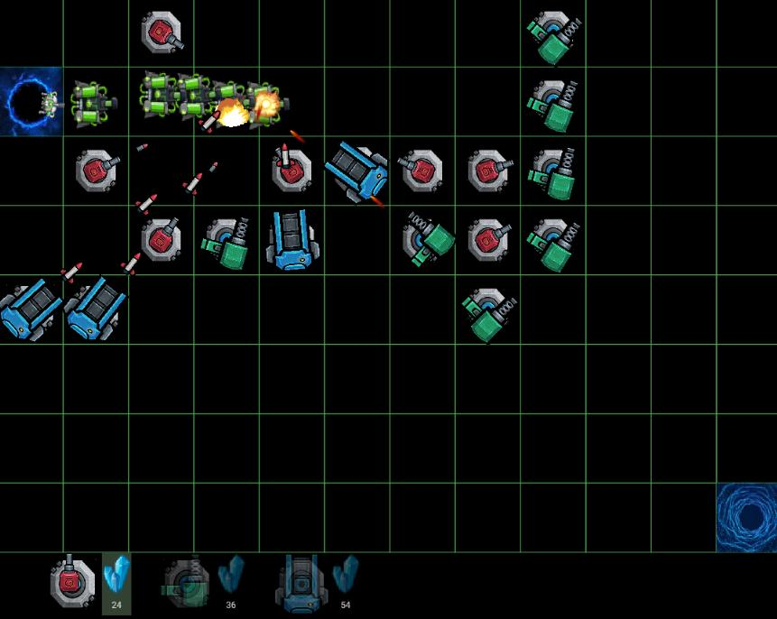

# FreeDefense V1

FreeDefense Game with Flutter and Flame.

## DEMO: [Web version for V0]  
[Web version] http://freedefense.vquant.ml/

Controls:
- Click:  preview the weapon.  (do not block the enemies!)
- Click again: build weapon.
- Click on weapon: update and destroy the weapon
- Collect mine to build weapon

## TODO
* [ ] Game 
    - [ ] Toast to indicate wrong action
    - [ ] Game guide
    - [v] Collect coin and use coin to create cannon
    - [ ] Game Failure/Re-start
* [ ] Weapons
    - [ ] Add more Weapon types
    - [v] Upgrade Weapon with more features. (faster bullet/better aiming/more damage)
* [v] Enemies
    - [v] Add life indicator
* [ ] Next version [TBD]
    - [ ] More topography 
    - [ ] Medal system
 

