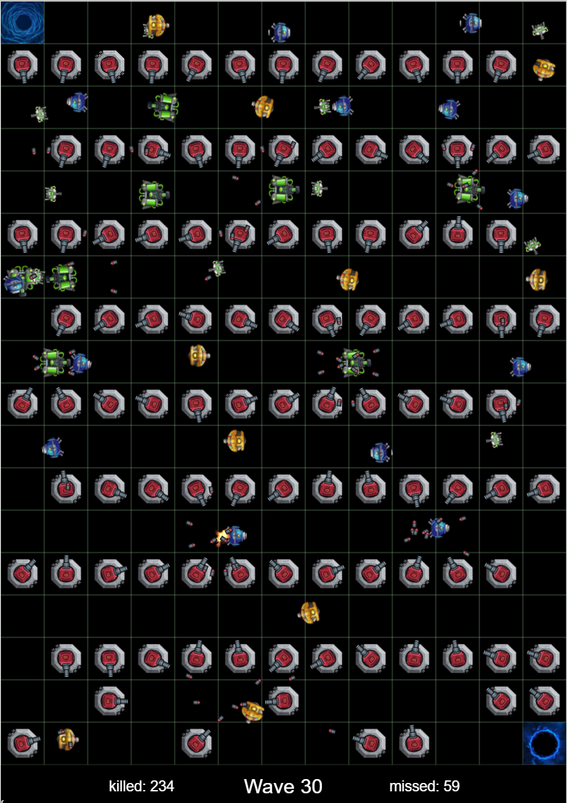

# FreeDefense

FreeDefense Game with Flutter and Flame.

## DEMO: [Web version] 
[Web version] http://freedefense.fluttergame.ml

Controls:
- Click:  preview the cannon.  (donot block all the ways!)
- Click agin:  Build cannon.   
- Double clcik:  Remove cannon.  (you will still see the preview)

## TODO
* [ ] Game 
    - [ ] Toast to indicate wrong action
    - [ ] Game guide
    - [ ] Collect coin and use coin to create cannon
    - [ ] Game Failure/Re-start
* [ ] Cannons
    - [ ] Add more Cannon types
    - [ ] Upgrade Cannons with more featurs. (faster bullet/better aiming/more damage)
    - [ ] Add missles 
* [ ] Enemies
    - [ ] Add life indicator
* [ ] Next version [TBD]
    - [ ] Add mine and miner to collect coin
    - [ ] Different coin for differnt cannon
    - [ ] More topography 
    - [ ] Medal system
 

